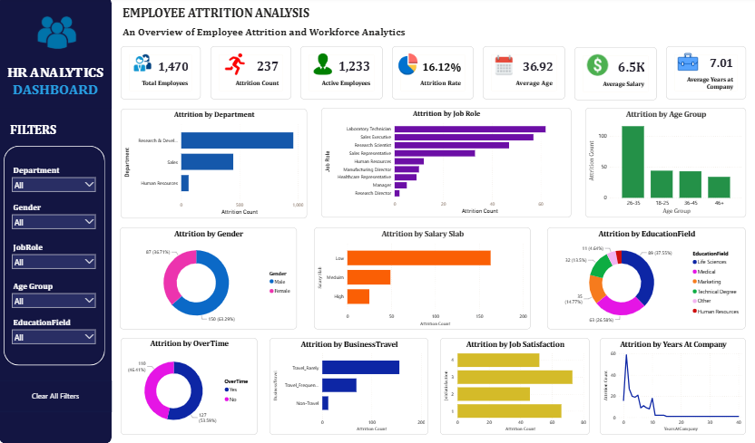

# HR-Analytics-Dashboard

An end-to-end HR Analytics project built using **SQL, Python, and Power BI** to analyze employee attrition, workforce demographics, and key HR metrics. The project transforms raw HR data into meaningful business insights through SQL analysis, Python-based exploratory data analysis (EDA), and an interactive Power BI dashboard.

## Project Overview

Employee attrition is a critical challenge for organizations as it impacts productivity, recruitment costs, and business performance. This project analyzes employee data to identify the factors influencing attrition and provides actionable insights through interactive visualizations and key performance indicators (KPIs).

## Objectives

- Analyze employee attrition trends.
- Identify departments and job roles with the highest attrition.
- Evaluate the impact of overtime, business travel, salary, and job satisfaction on employee turnover.
- Build an interactive HR dashboard for data-driven decision-making.

## Tools & Technologies

- **SQL (MySQL)** – Data exploration and business analysis
- **Python** – Data cleaning, EDA, and visualization
- **Power BI** – Interactive dashboard development
- **DAX** – KPI calculations and custom measures

## Dataset

**Dataset:** IBM HR Analytics Employee Attrition & Performance Dataset

The dataset contains employee information including:
- Age
- Department
- Job Role
- Monthly Income
- Education Field
- Business Travel
- Overtime
- Job Satisfaction
- Years at Company
- Attrition Status

## Project Workflow

### 1. SQL Analysis
- Data exploration
- Data validation
- Business analysis queries
- Advanced SQL queries
- Window functions
- Common Table Expressions (CTEs)

### 2. Python Analysis
- Data preprocessing
- Missing value validation
- Exploratory Data Analysis (EDA)
- Attrition analysis
- Correlation analysis
- Business insights

### 3. Power BI Dashboard
- Interactive KPI cards
- DAX measures
- Dynamic slicers
- Interactive charts
- Professional dashboard layout

## Dashboard KPIs

- Total Employees
- Attrition Count
- Active Employees
- Attrition Rate
- Average Age
- Average Salary
- Average Years at Company

## Dashboard Visualizations

- Attrition by Department
- Attrition by Job Role
- Attrition by Age Group
- Attrition by Gender
- Attrition by Salary Slab
- Attrition by Education Field
- Attrition by Overtime
- Attrition by Business Travel
- Attrition by Job Satisfaction
- Attrition by Years at Company

## Key Business Insights

- Sales and Research & Development departments experience the highest employee attrition.
- Employees working overtime are more likely to leave the organization.
- Frequent business travel is associated with higher attrition.
- Employees with lower monthly income show higher attrition rates.
- Most employee attrition occurs during the early years of employment.
- Job satisfaction plays a significant role in employee retention.

### Dashboard Preview

```
```
## Skills Demonstrated

- SQL
- MySQL
- Python
- Pandas
- NumPy
- Matplotlib
- Seaborn
- Power BI
- DAX
- Data Cleaning
- Exploratory Data Analysis (EDA)
- Business Intelligence
- Dashboard Design
- Data Visualization


